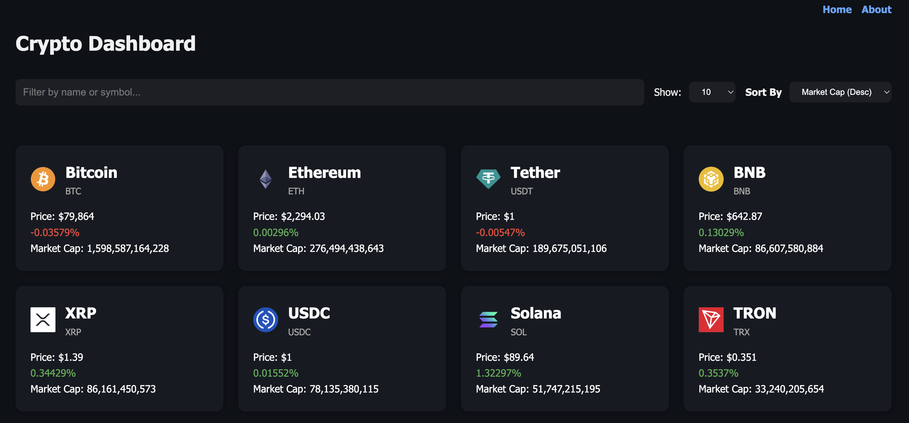
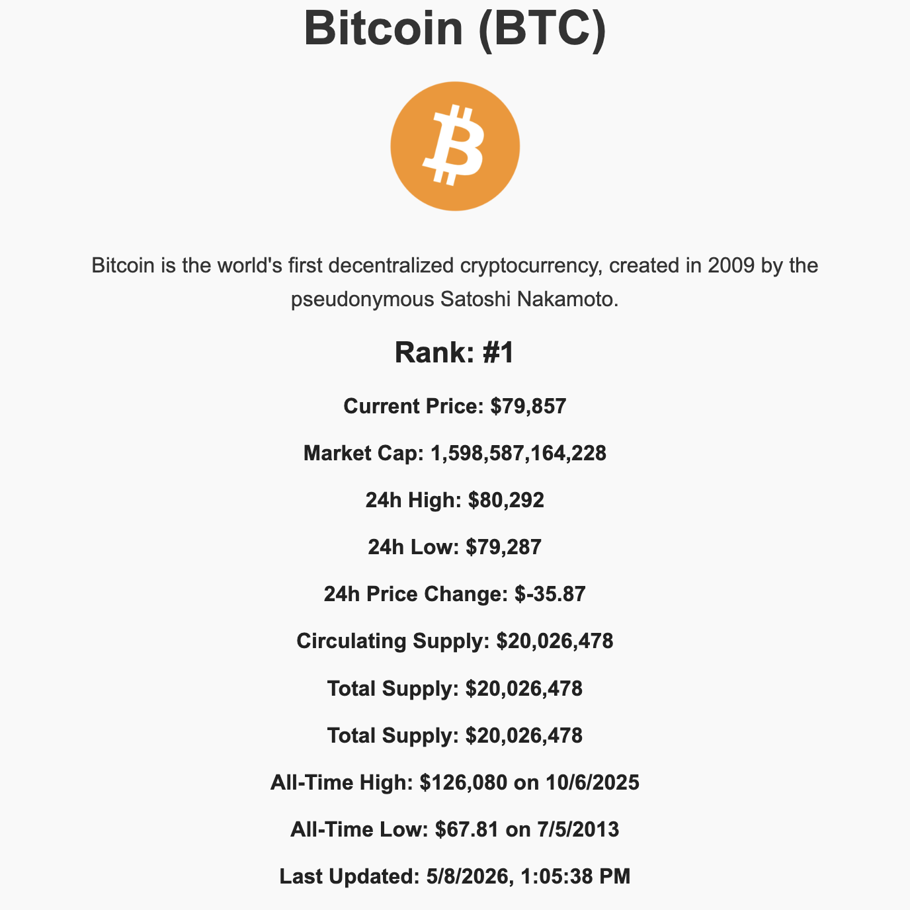
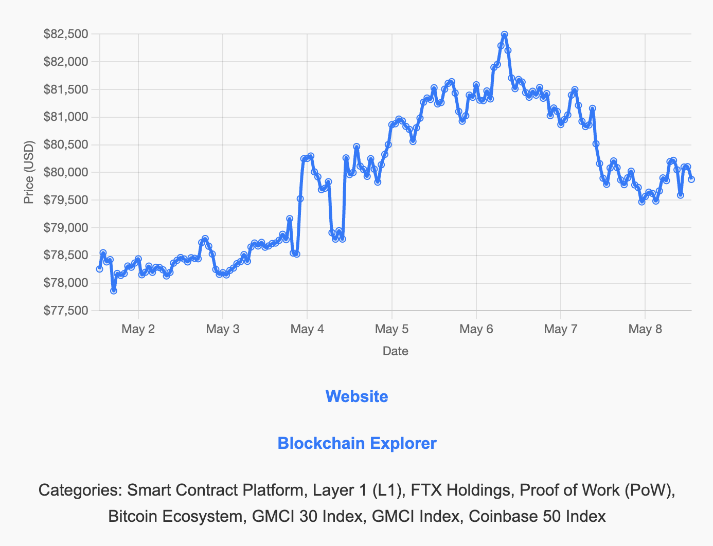

# 🚀 Crypto Dashboard

A modern and responsive cryptocurrency dashboard built using React, Vite, and Chart.js.  
This application provides real-time cryptocurrency market insights with interactive charts, trending data, and responsive UI components.

---

## 📸 Preview



---

## ✨ Features

- 📈 Real-time cryptocurrency market data
- 📊 Interactive charts using Chart.js
- 🔍 Search and filter cryptocurrencies
- 📱 Fully responsive design
- ⚡ Fast performance with Vite
- 🌙 Clean and modern UI
- 🔄 Dynamic data rendering
- 📉 Price trend visualization

---

## 🛠️ Tech Stack

### Frontend
- React
- Vite
- JavaScript (ES6+)
- CSS / Tailwind CSS (if applicable)

### Libraries & Tools
- react-chartjs-2
- Chart.js
- Axios / Fetch API
- React Hooks

---

## 📂 Project Structure

```bash
src/
│
├── components/      # Reusable UI components
├── pages/           # Page-level components
├── services/        # API calls and utilities
├── assets/          # Images and static files
├── App.jsx
└── main.jsx